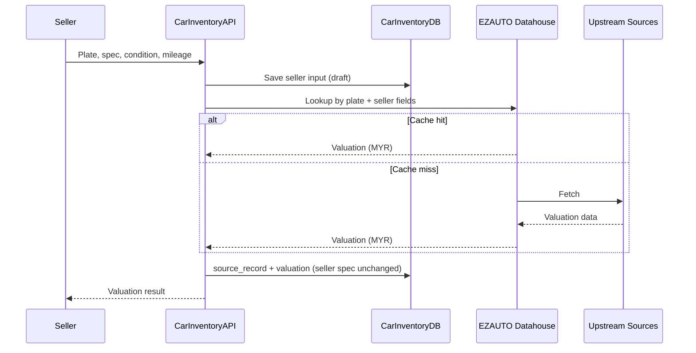

# CARINVENTORY — Car Valuation & Inventory Marketplace Proposal

Database schema · multi-source valuation strategy · rollout plan

Purpose. Build one Malaysia-market platform that
(1) lets private sellers upload a vehicle and receive a valuation in MYR,
(2) publishes validated listings on a buyer-facing marketplace, and
(3) sends seller-provided data to the EZAUTO Central Vehicle Datahouse for lookup and valuation — storing the result locally and updating the user, with the rule-based engine retained only as a prototype / offline fallback.

This proposal covers three things: §1 the database schema, §2 how we store and merge data arriving from different sources (seller intake, EZAUTO datahouse, local cache), and §3 the rollout plan from interactive prototype to production.

---

## Section 1 — Database Schema

### 1.1 Design principles

• Plate is the seller-facing identity; `vehicle_id` is the system identity — plate is a searchable alias, not the PK.

• One vehicle, one listing — spec/condition on `vehicle`; commerce state (MYR price, status, views) on `listing`.

• Valuation is versioned — every run stores `algorithm_version` + `factors_json` for audit and replay.

• PII protected — blind index to search, encrypted copy to return (§1.3).

• EZAUTO payloads stored encrypted in `source_record.payload_enc` — re-derive without re-fetching.

• Production valuation via EZAUTO datahouse — seller data in, MYR valuation out; seller-entered spec is kept as-is.

### 1.2 Schema diagram

CarInventory stores what EZAUTO returns — not the datahouse itself. On each production valuate call, the API writes an encrypted `source_records` row (raw EZAUTO JSON) and a `valuations` row (MYR low / mid / high derived from that response). Rule-engine fallback writes `valuations` only (`source_record_id` null).

```mermaid
erDiagram
    users ||--o{ vehicles : owns
    users ||--o{ listings : sells
    users ||--o{ inquiries : sends
    vehicles ||--o| listings : has
    vehicles ||--o{ vehicle_photos : has
    vehicles ||--o{ source_records : "EZAUTO response"
    vehicles ||--o{ valuations : has
    source_records ||--o| valuations : "derives"
    listings ||--o{ inquiries : receives

    users {
        uuid id PK
        varchar email UK
        varchar password_hash
        varchar name
        user_role role
    }

    vehicles {
        uuid id PK
        varchar plate_number UK
        varchar make
        varchar model
        int year
        int mileage_km
        condition_grade condition_grade
        vehicle_status status
        uuid seller_id FK
    }

    vehicle_photos {
        uuid id PK
        uuid vehicle_id FK
        varchar url
        int sort_order
        boolean is_primary
    }

    source_records {
        uuid id PK
        uuid vehicle_id FK
        varchar source_name "ezauto"
        bytea payload_enc
        timestamptz fetched_at
    }

    valuations {
        uuid id PK
        uuid vehicle_id FK
        uuid source_record_id FK "nullable"
        decimal estimated_low
        decimal estimated_mid
        decimal estimated_high
        jsonb factors_json
        varchar algorithm_version "ezauto-v1 | v1.0-rule-based"
        boolean source_fetched "EZAUTO upstream miss"
    }

    listings {
        uuid id PK
        uuid vehicle_id FK UK
        uuid seller_id FK
        decimal asking_price
        listing_status status
        int view_count
    }

    inquiries {
        uuid id PK
        uuid listing_id FK
        uuid buyer_id FK "nullable"
        varchar contact_email
        text message
        inquiry_status status
    }
```


### 1.3 How each field is stored — hashed, encrypted, or plaintext

Hash fields we only need to match, encrypt fields we must read back, and keep vehicle/listing facts as plaintext under KMS at-rest encryption — live secrets stay in Secrets Manager, not in a table.


| Technique            | Fields                                                                               | Reversible? |
| -------------------- | ------------------------------------------------------------------------------------ | ----------- |
| HMAC-SHA256 (pepper) | `vehicles.plate_number_bidx`                                                         | No          |
| argon2id             | `users.password_hash`                                                                | No          |
| AES-256-GCM (KMS)    | `vehicles.plate_number_enc`, `inquiries.contact_email`, `source_records.payload_enc` | Yes         |
| Plaintext            | `vehicles` spec, `valuations`, `listings`, `vehicle_photos`, `users.name`            | —           |
| Not in DB            | Pepper, API keys, JWT keys, DB credentials                                           | —           |


**Why per field**

• `plate_number_bidx` — searchable without storing the plate in plaintext; a DB dump does not expose plates.

• `password_hash` — verify login only; never returned or decrypted.

• `plate_number_enc` — show the plate back to the seller after lookup by blind index.

• `inquiries.contact_email` — notify the seller; encrypted because it is buyer PII.

• `source_records.payload_enc` — keep the raw EZAUTO JSON for audit and re-derive without re-fetching.

• `vehicles` spec, `valuations`, `listings`, `vehicle_photos` — marketplace facts, not personal search keys; whole DB still encrypted at rest via KMS.

• `users.name` — display on listings and dashboard; not sensitive enough to hash or encrypt separately.

---

## Section 2 — How We Store Data From Different Data Sources

**Conflict rule:** seller input prevails for every field except valuation. EZAUTO (or rule-engine fallback) owns valuation only; reference data from EZAUTO is stored for audit, not written over seller fields.

### 2.1 Source-agnostic ingestion

On every production valuate, CarInventory sends seller data to EZAUTO for lookup. EZAUTO returns MYR valuation (from its store, or upstream on miss). Seller-entered `vehicles` fields are kept; CarInventory writes `valuations` and encrypted `source_records` only. Prototype (`demo/`) uses `lib/valuation.ts` instead; production falls back to it only if EZAUTO is unreachable.




| Source             | Supplies                                              | When                                    |
| ------------------ | ----------------------------------------------------- | --------------------------------------- |
| Seller             | Plate, spec, condition, photos, mileage, asking price | Always — authoritative for listing      |
| EZAUTO             | Valuation (MYR); reference payload (audit only)       | Every production valuate                |
| Rule engine v1.0   | Valuation + factors_json                              | Prototype; fallback if EZAUTO down      |
| CarInventory cache | Prior EZAUTO response                                 | Before re-calling EZAUTO if still fresh |


### 2.2 Conflict resolution strategy

One rule: **seller input wins; EZAUTO wins on valuation only.**


| Field                                                          | Authoritative source                            |
| -------------------------------------------------------------- | ----------------------------------------------- |
| Valuation (low / mid / high)                                   | EZAUTO datahouse (rule engine v1.0 on fallback) |
| Plate, make, model, year, trim, transmission, fuel_type, color | Seller                                          |
| Mileage, condition, description, photos                        | Seller                                          |
| Asking price                                                   | Seller                                          |


---

## Section 3 — Rollout Plan (interactive prototype → production platform)

Assess → host → protect → migrate → gate → cut over. Six phases:

### 3.1 Phase 1 — Data assessment & pre-cleaning

**Objective.** Understand exactly what we hold before touching the new system.

What we do. Profile all existing records: how many have a plate (and chassis/VIN where supplied); fill-rate of every field; duplicates; placeholder/junk values. Pre-clean on a working copy: standardise formats (upper-case and trim plate), convert placeholder text (e.g. "NO RECORD FOUND", "NOT ENTERED") into true empty values, fix inconsistent casing and dates. Lock the field list to keep vs discard (plate, make, model, year, trim, mileage, condition, photos, asking price). Walk through MVP user stories in `demo/`.

**Why it matters.** We migrate from facts, not assumptions — every surprise is found now, on a copy, never in production.

**Deliverable.** Data profiling & cleaning report (record counts, data quality, keep/drop list); signed-off prototype.

### 3.2 Phase 2 — Target database hosting

**Objective.** Stand up the new database before any data moves.

What we do. Provision managed PostgreSQL on isolated hosting (separate account, private network); enable storage encryption and automated backups; apply schema (§1); implement BFF endpoints; create a single temporary, tightly-scoped migration role removed once the move is done.

**Why it matters.** The new home is secured and isolated from day one; the migration can touch nothing else.

**Deliverable.** A running, empty, secured target database.

### 3.3 Phase 3 — Hashing & encryption design

**Objective.** Decide and build exactly how each field is protected — before any real data lands.

What we do. Finalise which fields are hashed, encrypted, or plaintext (§1.3); generate the secret keys (hashing pepper and encryption key) and store them in the secrets vault; implement and test the routines on sample data (plate BHK 3847 → `_bidx` + `_enc`).

**Why it matters.** Personal data (plate, buyer email) must be protected the instant it lands — never written in the clear, not even temporarily.

**Deliverable.** Tested hashing & encryption components, with keys secured in the vault.

### 3.4 Phase 4 — Migration with protection applied in-flight

**Objective.** Move cleaned data into the new database, applying protection as it goes.

What we do. For each record: clean → resolve identity (`vehicle_id` as system key; plate as seller-facing alias) → hash identifiers for lookup, encrypt real values → write into schema, tagging each field with its source. Store raw EZAUTO JSON encrypted in `source_records`. Wire Next.js to the BFF (JWT auth, S3 photos, server-side EZAUTO valuation per §2.1). The job is repeatable and restartable.

**Why it matters.** Data is protected during the move, not bolted on afterwards; a failed run can simply be re-run.

**Deliverable.** Populated database, migration run log, end-to-end sell/buy on staging.

### 3.5 Phase 5 — Data-quality gate (keep only useful records)

**Objective.** Carry across only listings worth storing and showing.

**Acceptance rule** — a listing is kept only if it has:  
• at least one usable identifier (plate), and  
• minimum core fields (make + model), and  
• ≥1 photo and a valuation record (EZAUTO or approved fallback).

Records below this bar are quarantined with the reason, not silently deleted.

**Why it matters.** We don't store or show worthless listings; every dropped record is accounted for and the threshold can be tuned.

**Deliverable.** Data-quality report (kept vs dropped counts with reasons); admin can approve pending listings.

### 3.6 Phase 6 — Validation & cutover

**Objective.** Prove the new database is correct, then switch to it safely.

What we do. Reconcile record and listing counts against source; spot-check samples (e.g. BHK 3847 valuation vs EZAUTO); run live flows (sell → valuate → publish → browse → inquiry); obtain sign-off; deploy frontend and API; keep old environment read-only as fallback, then retire per retention policy.

**Why it matters.** We go live only after the data is verified, with a safety net and a clean way back.

**Deliverable.** Validation & sign-off report, then go-live.

### User stories

Each row is a **goal**, not a UI task. Entering fields, clicking publish, or opening a filter are tasks that support a story — they belong in acceptance criteria, not here.

Read as: *As a [Role], I want [Goal], so that [So that…].*


| Role           | Goal | So that… |
| -------------- | ---- | -------- |
| Seller         | register and log in securely | only I can access and manage my account and listings |
|                | create and publish a listing for my vehicle with its details and photos | interested buyers can discover it |
|                | an automated valuation estimate the moment I publish my vehicle | I can price it accurately and with confidence |
|                | be notified by email and SMS when a buyer enquires about my vehicle | I can respond promptly and not miss a sale |
| Reseller       | sell a client’s vehicle on the marketplace | the owner reaches buyers without listing the car themselves |
|                | manage all my client sales in one place                    | I stay on top of every consignment without losing track                 |
|                | act as the enquiry contact for client listings             | the owner gets professional representation without handling buyer calls |
| Buyer          | find vehicles that match what I am looking for             | I can shortlist options without creating an account                     |
|                | compare listings on price, mileage, and spec               | I focus on the best-value cars before I enquire                         |
|                | judge a listing before I contact anyone                    | I only reach out for vehicles worth pursuing                            |
|                | start a conversation with the seller or reseller           | I can ask questions or arrange a viewing                                |
| Platform admin | run marketplace moderation separately from the public site | listing decisions are not mixed with the buyer/seller experience        |
|                | keep the listing approval queue moving                     | sellers go live quickly and buyers see fresh inventory                  |
|                | prevent low-quality listings from going public             | buyers trust what appears on the marketplace                            |
|                | remove listings that breach policy                         | the platform stays safe and credible                                    |


