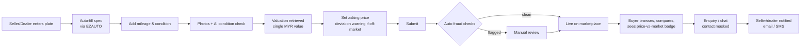
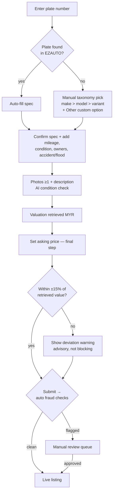
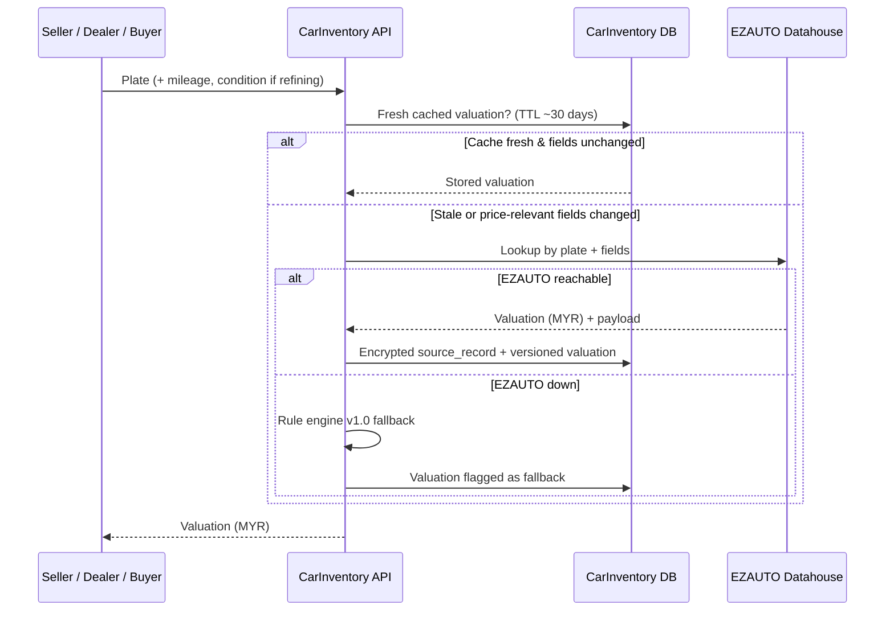
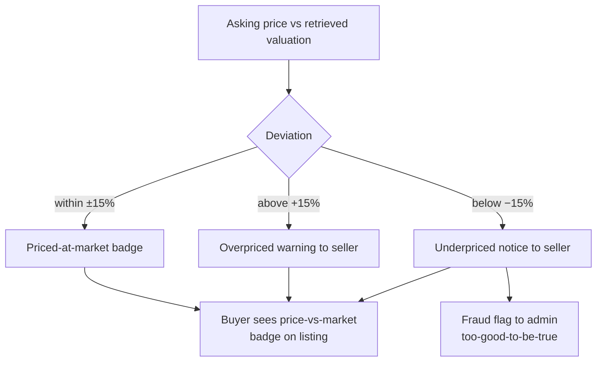
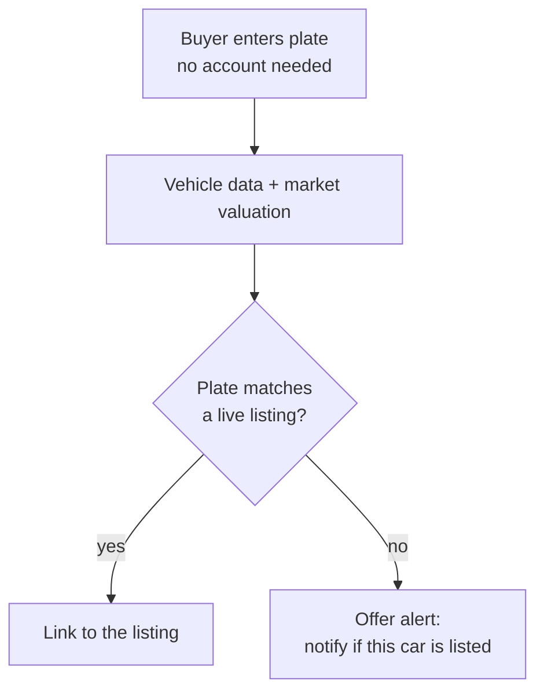
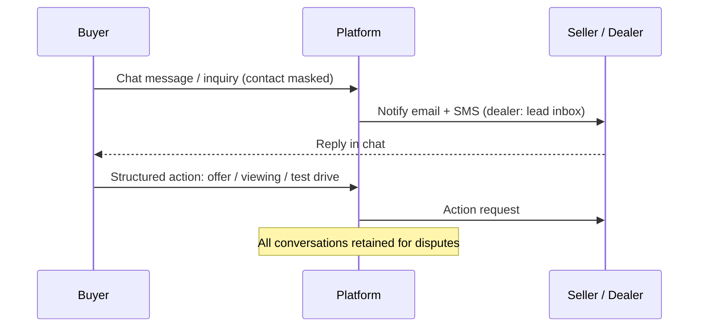
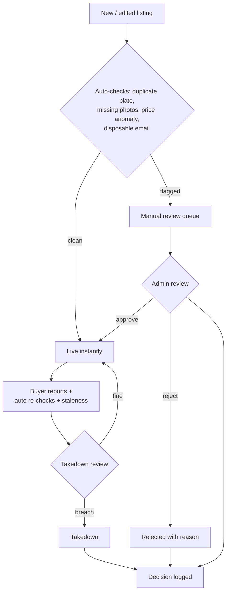
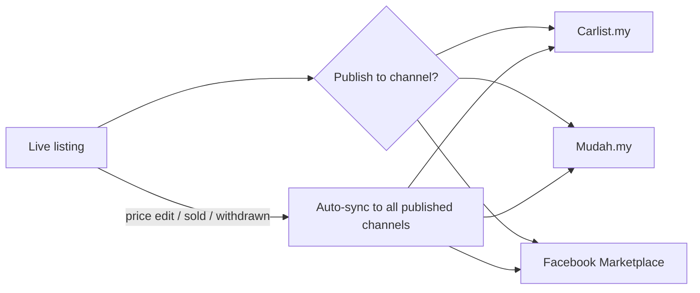
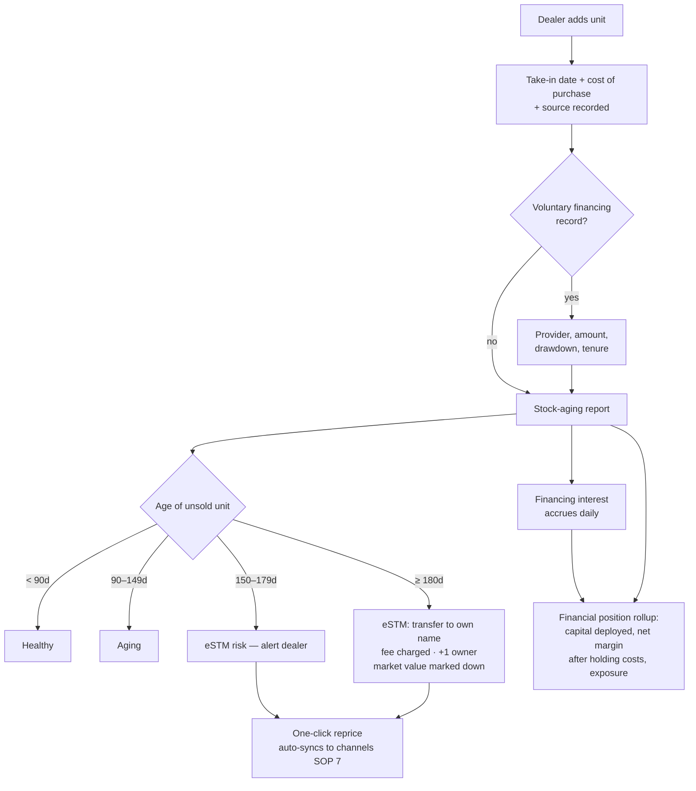

# CarInventory — Critical Flows (SOP)

Standard operating flows modelled on Carsome / AutoGrab. User stories in `requirements.md`.

## Main flow (end to end)

Plate lookup → condition → photos verified → valuation → price → publish → browse → enquire.

## SOP 1 — Listing creation (seller or dealer)

1. The vehicle-details form is shown upfront. Seller enters car plate and/or chassis number → platform queries the valuation SaaS (EZAUTO) → a hit auto-fills the form (make, model, variant, year, engine, transmission, colour); every field stays editable.
2. On lookup miss: the seller completes the same form manually — taxonomy dropdowns (make → model → variant), each with an **"Other (custom)"** free-text option for vehicles outside the catalogue. Custom entries are auto-flagged for data-quality review (SOP 6) so the taxonomy can be extended.
3. Seller confirms/corrects spec, adds mileage, condition grade, owners, accident/flood declaration.
4. Add photos (≥1 required) and description; AI photo-condition analysis verifies the declared grade against the photos.
5. Only now is the valuation revealed (single MYR value) — computed on complete, photo-verified information.
6. Seller sets asking price as the final input. If it deviates beyond threshold (e.g. ±15% of the retrieved value), show a warning — advisory, not blocking.
7. Automated fraud & quality checks run on submit: **clean listings go live instantly**; flagged listings are held in the manual review queue (SOP 6).

## SOP 2 — Valuation (two-stage, cached, with fallback)

- **In the listing flow, the valuation is revealed only after full information**: spec, mileage/condition, and photos (AI photo analysis verifies the declared condition first). The seller then sets the price as the last step, against a number based on verified data.
- Identity-only instant estimates remain for the buyer plate check and dealer appraisal, where the spec comes verified from the datahouse.
- Every valuation stored and versioned (`algorithm_version`, factors, source payload) for audit.
- Cache SaaS responses per vehicle with a TTL (~30 days); re-valuate only when price-relevant fields change (mileage, condition), not on photo/description edits.
- Fallback to rule engine v1.0 if the SaaS is unreachable; result flagged as fallback.

## SOP 3 — Price deviation warning

- Compare asking price against the latest retrieved valuation.
- Within threshold → "priced at market" indicator. Above → overpriced warning to seller. Below → underpriced notice to seller and possible fraud flag to admin (too-good-to-be-true detection).
- Buyer side shows the same signal as a price-vs-market badge on the listing.

## SOP 4 — Buyer plate lookup

1. Buyer enters a plate number (no account needed for a basic check).
2. Platform returns vehicle data + the retrieved market valuation.
3. If the plate matches a live listing, link to it; otherwise offer "get notified if this car is listed".
4. Lookups are logged for audit.

## SOP 5 — Enquiry & communication

1. Buyer contacts via on-platform chat or inquiry form; phone/email masked.
2. Seller/dealer notified by email + SMS; dealer leads land in the shared lead inbox.
3. Structured actions in chat: make offer, request viewing/test drive.
4. All conversations retained for dispute handling.

## SOP 6 — Moderation (risk-based)

1. Auto-checks run on every new/edited listing: duplicate plate, missing photos, price anomaly vs valuation, disposable email, custom vehicle spec outside the catalogue, photo condition mismatch (AI analysis of the uploaded photos vs the declared condition grade; if the grade is corrected, the valuation is re-run).
2. **Clean listings publish instantly** — no human in the loop, sellers go live fast.
3. **Flagged listings only** enter the manual review queue: approve, or reject with reason.
4. Live listings can still be taken down later (signals below); every decision logged.
5. Dealer verification (business registration check) before dealer privileges are granted.

**How takedown candidates surface (live listings).** Admin doesn't hunt manually — three signals feed the takedown review:
- **Buyer reports** — a "Report listing" action on every listing (suspected scam, wrong info, already sold, odometer concern); reported listings queue for admin with the reasons attached.
- **Auto re-checks** — flags re-run on live listings: price drops far below valuation after approval, a duplicate plate appearing later, seller account anomalies.
- **Staleness** — listings past expiry or with a plate that reappears in a new listing get queued for confirmation.

## SOP 7 — Classified syndication (aggregator)

1. Live (approved) listings can be published to connected external channels: Carlist.my, Mudah.my, Facebook Marketplace.
2. Photos, price and details are pushed once; **price edits, mark-as-sold and withdrawals sync automatically** to every published channel — no manual re-posting.
3. Listings still in review can be syndicated only after they go live; admin takedowns retract the external posts too.
4. (Future) leads from external channels flow back into the platform inbox.

## SOP 8 — Stock aging & financial position (dealer)

Car dealing is a credit-bearing business — dealers must sell fast and keep cash flowing. A unit
that doesn't sell within **6 months of STMS take-in becomes eSTM** (hard to sell), so aging
alerts are designed around that window.

1. When a dealer adds a unit, the wizard captures the **stock take-in date, cost of purchase and
   source** (AP supplier, trade-in, auction) — internal data, never shown to buyers.
2. **Voluntary financing record**: the dealer can opt in to record financing against the unit
   (provider, amount, drawdown date, tenure).
3. The stock-aging report tracks every unsold own-stock unit's age: **Healthy (<90d) → Aging
   (90–149d) → eSTM risk (150–179d) → eSTM (≥180d)**, with alerts from day 150.
4. **What crossing into eSTM costs the dealer** — the temporary STMS status lapses, so ownership
   must be transferred into the dealer's own name. The system reflects all three consequences:
   - **Transfer fee charged** (JPJ transfer + admin) — added to the unit's holding cost.
   - **+1 owner on the record** — the market prices this in, so the unit's market value is
     automatically marked down (−8% in the mock).
   - **Financing interest keeps accruing** (8% p.a. on the voluntary financing record in the
     mock) — every idle day eats margin.
5. Financial position rolls up live: capital deployed (Σ cost), **net potential profit
   (Σ asking − cost − holding costs)**, financing exposure with interest accrued to date, units
   at risk.
6. At-risk units get a one-click reprice action; price changes auto-sync to every published
   classified channel (SOP 7). Consignment units are excluded — the owner's capital, not the
   dealer's.

