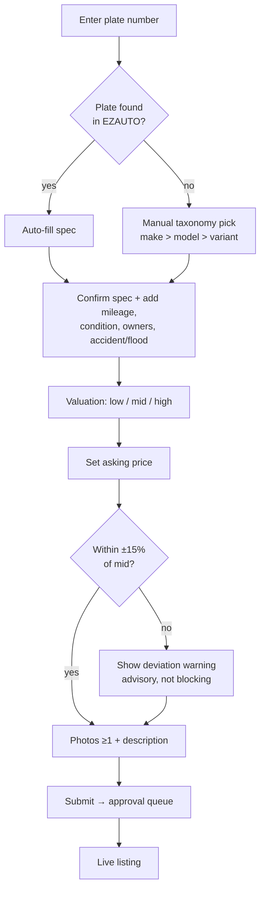
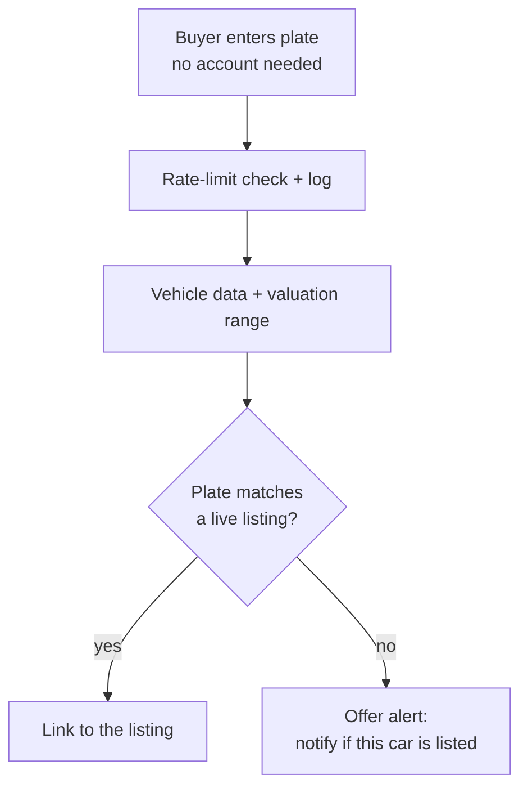
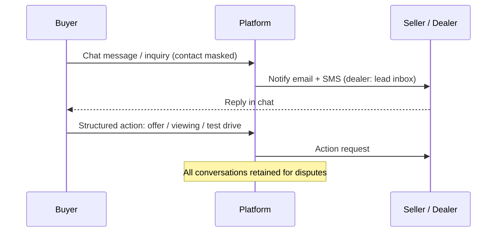
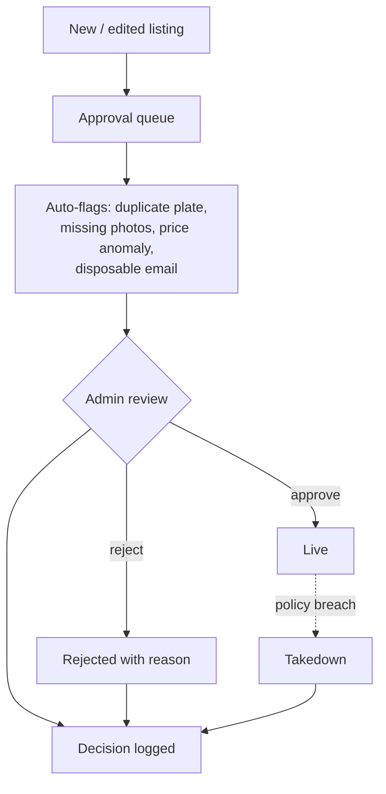

# CarInventory — Critical Flows (SOP)

Standard operating flows modelled on Carsome / AutoGrab. User stories in `requirements.md`.

## Main flow (end to end)

Plate lookup → valuation → price → publish → approve → browse → enquire.

```mermaid
flowchart LR
    A[Seller/Dealer enters plate] --> B[Auto-fill spec<br>via EZAUTO]
    B --> C[Add mileage & condition]
    C --> D[Valuation<br>MYR low / mid / high]
    D --> E[Set asking price<br>deviation warning if off-market]
    E --> F[Photos + submit]
    F --> G[Admin approval queue]
    G --> H[Live on marketplace]
    H --> I[Buyer browses, compares,<br>sees price-vs-market badge]
    I --> J[Enquiry / chat<br>contact masked]
    J --> K[Seller/dealer notified<br>email / SMS]
```

## SOP 1 — Listing creation (seller or dealer)

1. Enter plate number → platform queries valuation SaaS (EZAUTO) → auto-fill make, model, variant, year, engine, transmission.
2. On lookup miss: manual selection from the vehicle taxonomy (make → model → variant dropdowns, never free text).
3. Seller confirms/corrects spec, adds mileage, condition grade, owners, accident/flood declaration.
4. Platform returns valuation: low / mid / high MYR.
5. Seller sets asking price. If price deviates beyond threshold (e.g. ±15% of mid), show a warning — advisory, not blocking.
6. Add photos (≥1 required) and description → submit.
7. Listing enters admin approval queue → approved listings go live.

## SOP 2 — Valuation (two-stage, cached, with fallback)

- **Two-stage:** instant estimate from identity fields (plate/make/model/variant/year), refined estimate once condition fields are added.
- Every valuation stored and versioned (`algorithm_version`, factors, source payload) for audit.
- Cache SaaS responses per vehicle with a TTL (~30 days); re-valuate only when price-relevant fields change (mileage, condition), not on photo/description edits.
- Fallback to rule engine v1.0 if the SaaS is unreachable; result flagged as fallback.

## SOP 3 — Price deviation warning

- Compare asking price against latest valuation mid.
- Within threshold → "priced at market" indicator. Above → overpriced warning to seller. Below → underpriced notice to seller and possible fraud flag to admin (too-good-to-be-true detection).
- Buyer side shows the same signal as a price-vs-market badge on the listing.

## SOP 4 — Buyer plate lookup

1. Buyer enters a plate number (no account needed for a basic check).
2. Platform returns vehicle data + market valuation range.
3. If the plate matches a live listing, link to it; otherwise offer "get notified if this car is listed".
4. Rate-limit and log lookups to control SaaS cost and abuse.

## SOP 5 — Enquiry & communication

1. Buyer contacts via on-platform chat or inquiry form; phone/email masked.
2. Seller/dealer notified by email + SMS; dealer leads land in the shared lead inbox.
3. Structured actions in chat: make offer, request viewing/test drive.
4. All conversations retained for dispute handling.

## SOP 6 — Moderation

1. New/edited listings enter the approval queue.
2. Auto-flags assist review: duplicate plate, missing photos, price anomaly vs valuation, disposable email.
3. Approve, reject with reason, or take down for policy breach; every decision logged.
4. Dealer verification (business registration check) before dealer privileges are granted.

